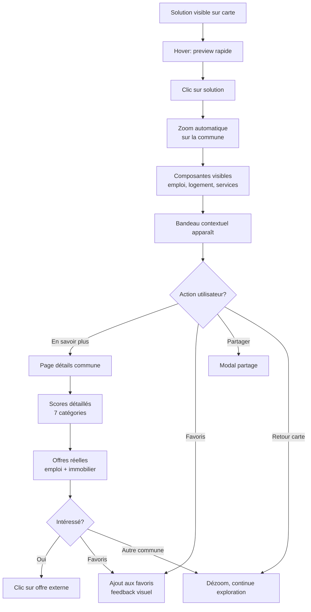

# UX Design Specification Bienvenue

**Author:** Gabriel
**Date:** 2026-01-22

---

## Executive Summary

### Project Vision

Bienvenue est une plateforme de relocation intelligente qui recommande aux citoyens français leur commune idéale. L'approche UX se distingue par :

- **Commune-first** : La commune est le produit final, pas une combinaison fragmentée emploi/logement/loisirs
- **Conversation naturelle** : Agents LLM remplacent les interfaces à filtres multiples
- **Validation temps réel** : Chaque recommandation est vérifiée avec des offres concrètes
- **Transparence méthodologique** : 900 indicateurs documentés et sources publiques

### Target Users

**5 personas représentatifs :**

1. **Alex (Jeune Actif Tech)** - 28 ans, développeur Paris, cherche évasion urbaine sans sacrifier carrière
2. **Les Martin (Famille)** - 35 ans, 2 enfants, critères multiples et contradictoires (école, 2 emplois, budget)
3. **Jean (Retraité)** - 65 ans, Lille, climat doux, santé, accessibilité numérique limitée
4. **Sophie (Téléworker)** - 40 ans, freelance 100% remote, équilibre nature/connectivité
5. **Léa (Étudiante)** - 20 ans, budget serré, mobilité temporaire

**Diversité clé** : De 20 à 65 ans, de tech-savvy à novice numérique, de célibataire à famille.

### Key Design Challenges

1. **Équilibre conversation/action** - Interface conversationnelle sans devenir un obstacle à l'action directe
2. **Visualisation complexité** - Rendre 7 catégories × 10 communes × triple comparaison digestible
3. **Confiance algorithmique** - Transparence méthodologie pour décisions de vie majeures
4. **Accessibilité multi-générationnelle** - Interface intuitive pour tous niveaux tech (Jean 65 ans ↔ Léa 20 ans)

### Design Opportunities

1. **Moments "Aha!" amplifiés** - Micro-interactions et feedback visuel aux moments de pertinence, validation, opportunité
2. **Carte comme outil de découverte** - Navigation par similarité, exploration intuitive
3. **Progressive disclosure** - Scores simples → détails à la demande
4. **Conversation éducative** - Onboarding naturel par l'expression des critères

## Core User Experience

### Defining Experience

L'expérience Bienvenue est **carte-centrique** : la carte interactive est l'interface principale, pas un complément. Les utilisateurs passent leur temps à explorer visuellement les communes (solutions) et consulter leurs données détaillées.

**Flux d'interaction principal :**
1. Solutions apparaissent sur la carte
2. Clic sur une solution → Zoom automatique + affichage des composantes
3. Bandeau contextuel propose : "En savoir plus" | Partager | Favoris
4. "En savoir plus" → Page détaillée avec scores et données complètes

**Inputs utilisateur :**
- Messages textuels dans la conversation (expression des critères)
- Ajout/retrait des favoris
- Navigation carte (zoom, pan, clic)

### Platform Strategy

**Web desktop-first**
- Interface optimisée pour écrans larges (≥1280px)
- Carte en plein écran avec panneaux latéraux
- Interactions souris/trackpad (hover states, clics précis)
- Mobile non prioritaire pour MVP

**Implications design :**
- Pas de contraintes tactiles à considérer
- Espace généreux pour données complexes
- Hover states pour preview rapide
- Layouts multi-colonnes possibles

### Effortless Interactions

**Ce qui doit être organique :**
- La conversation qui "comprend" les critères sans reformulation
- L'apparition des solutions sur la carte (pas de bouton "rechercher")
- Le zoom fluide au clic sur une solution
- Le passage carte → détails → retour carte

**Zéro friction :**
- Pas de formulaires à remplir
- Pas de filtres visibles à manipuler
- Pas d'étapes intermédiaires avant les résultats
- Pas de loading screens bloquants (feedback progressif)

### Critical Success Moments

**Moment 1 : Première recommandation**
- L'utilisateur voit sa première solution apparaître sur la carte
- Émotion cible : "Cette commune existe vraiment pour moi"
- UX : Animation subtile d'apparition, placement naturel sur la carte

**Moment 2 : "En savoir plus"**
- L'utilisateur découvre les scores détaillés et données complètes
- Émotion cible : "Les données confirment mon intuition"
- UX : Transition fluide, données organisées par pertinence

### Experience Principles

1. **Carte-centrique** - La carte est l'interface, pas un widget. Tout gravite autour d'elle.

2. **Interaction organique** - Pas de formulaires ni filtres visibles. Conversation + clics naturels.

3. **Révélation progressive** - Solutions → Composantes → Détails. Chaque niveau à la demande.

4. **Minimalisme d'input** - L'utilisateur parle et clique. Le système fait le travail.

5. **Moments de découverte** - Chaque recommandation est une révélation, pas une ligne de résultat.

## Desired Emotional Response

### Primary Emotional Goals

**Arc émotionnel central :** Transformer le scepticisme initial en enthousiasme durable.

- **Émerveillement** - L'utilisateur découvre des possibilités qu'il n'imaginait pas
- **Surprise** - Les recommandations dépassent ses attentes
- **Ambition** - Il se projette dans un nouveau chapitre de vie
- **Enthousiasme** - L'énergie positive persiste après la session

### Emotional Journey Mapping

| Phase | Émotion entrante | Émotion cible | Transition UX |
|-------|------------------|---------------|---------------|
| **Arrivée** | Scepticisme + Curiosité | Curiosité engagée | Interface épurée, pas de promesses exagérées |
| **Conversation** | Curiosité prudente | Intérêt croissant | L'agent "comprend vraiment", questions pertinentes |
| **Première recommandation** | Attente méfiante | Émerveillement | Apparition visuelle sur carte, commune inattendue mais pertinente |
| **Exploration détails** | Surprise | Ambition + Confiance | Données qui confirment l'intuition, offres réelles |
| **Départ** | Enthousiasme | Enthousiasme maintenu | Call-to-action subtil (favoris, partage), pas de pression |

### Micro-Emotions

**Confiance vs Scepticisme**
- Critique pour Bienvenue : l'utilisateur doit faire confiance à un algorithme pour une décision de vie
- Design : transparence des sources, pas de "boîte noire", données vérifiables

**Excitation vs Anxiété**
- Déménager = décision majeure, potentiellement anxiogène
- Design : ton positif mais réaliste, pas de pression, exploration libre

**Accomplissement vs Frustration**
- Trouver SA commune parmi 35 000 = aiguille dans botte de foin
- Design : résultats pertinents rapidement, pas de recherche sans fin

### Design Implications

**Pour créer l'émerveillement :**
- Animations subtiles d'apparition des solutions sur la carte
- Communes "inattendues mais évidentes" en haut du classement
- Révélation progressive des détails (effet de découverte)

**Pour maintenir l'enthousiasme post-session :**
- Système de favoris pour "garder" les découvertes
- Partage facile (envoyer à un proche)
- Pas de friction au retour (session persistante)

**Pour convertir le scepticisme en confiance :**
- Pas de promesses marketing exagérées
- Sources des données visibles
- Offres réelles validées (pas de "ville parfaite" théorique)

### Emotional Design Principles

1. **Sous-promettre, sur-délivrer** - L'interface est modeste, les résultats impressionnent

2. **Émerveillement par la pertinence** - La surprise vient de "comment ils ont su ?", pas d'effets visuels gratuits

3. **Ambition accessible** - Montrer que le changement est possible ET réaliste

4. **Enthousiasme sans pression** - L'utilisateur explore à son rythme, pas de dark patterns

5. **Confiance par la transparence** - Chaque recommandation est explicable et vérifiable

## UX Pattern Analysis & Inspiration

### Inspiring Products Analysis

**Airbnb - Référence principale**
- Fluidité et clarté d'interface exemplaires
- Carte interactive avec listings visuels
- Transitions douces entre états
- Déjà implémenté : carte "magic card" inspirée d'Airbnb dans le repo actuel
- À retenir : élégance sans sacrifier la densité d'information

**Spotify Discover / Pinterest**
- L'effet "wow" de la recommandation inattendue mais pertinente
- "Comment ils ont su que j'aimerais ça ?"
- Sentiment de découverte personnalisée
- À retenir : l'algorithme doit surprendre positivement, pas juste confirmer

**ChatGPT / Perplexity / Claude**
- Simplicité naturelle de l'input textuel
- Pas de courbe d'apprentissage
- Réponses progressives (streaming)
- À retenir : le chat ne doit pas être compliqué, c'est un outil transparent

**Joko (agrégation d'offres)**
- Innovation dans la présentation d'offres multiples
- Clarté malgré la complexité des données
- À retenir : inspiration pour l'affichage des offres emploi/immobilier

### Transferable UX Patterns

**Patterns à adopter :**

| Source | Pattern | Application Bienvenue |
|--------|---------|----------------------|
| Airbnb | Carte interactive + cards visuelles | Vue principale des solutions |
| Airbnb | Transitions fluides entre vues | Zoom solution → détails |
| Spotify | Recommandation "magique" | Communes inattendues en top ranking |
| ChatGPT | Input textuel minimaliste | Zone conversation épurée |
| ChatGPT | Streaming progressif | Feedback pendant le traitement |

**Patterns à adapter :**

| Source | Pattern original | Adaptation Bienvenue |
|--------|------------------|---------------------|
| Airbnb | Filtres visibles multiples | Conversation remplace les filtres |
| Pinterest | Feed infini scroll | Top 10 limité (qualité > quantité) |
| Joko | Agrégation dense | Révélation progressive des offres |

### Anti-Patterns to Avoid

**Google Maps - Rigidité**
- Interface trop technique/utilitaire
- Manque de fluidité émotionnelle
- Sensation "outil" plutôt que "expérience"
- À éviter : ne pas transformer la carte en GPS froid

**Sites immobiliers classiques (SeLoger, LeBonCoin)**
- Formulaires à 20 champs
- Listes interminables sans personnalisation
- Aucun effet "découverte"
- À éviter : l'approche "moteur de recherche" classique

**Dashboards data surchargés**
- Trop de chiffres visibles simultanément
- Paralysie par l'information
- À éviter : ne pas noyer l'utilisateur dans les 900 indicateurs

### Design Inspiration Strategy

**Adopter directement :**
- Airbnb : Carte + cards, transitions fluides (déjà en cours)
- ChatGPT : Simplicité du chat, pas de features inutiles

**Adapter pour Bienvenue :**
- Spotify Discover : L'effet "wow" mais pour des communes, pas de la musique
- Joko : Agrégation claire mais avec progressive disclosure

**Éviter absolument :**
- Google Maps : Rigidité utilitaire sans émotion
- Sites immobiliers : Formulaires et listes sans âme
- Dashboards analytics : Surcharge cognitive

**Différenciateur Bienvenue :**
La combinaison unique = Airbnb (carte élégante) + Spotify (magie de la recommandation) + ChatGPT (input naturel). Aucun concurrent ne combine ces trois.

## Design System Foundation

### Design System Choice

**Stack technique retenu :**
- **Tailwind CSS** - Utility-first CSS framework
- **shadcn-svelte** - Composants accessibles et personnalisables (https://www.shadcn-svelte.com)
- **Magic Svelte UI** - Animations fluides style Airbnb (https://animation-svelte.vercel.app/magic)
- **bits-ui** - Primitives headless sous-jacentes

**Justification :**
- Stack déjà en place et fonctionnel
- shadcn-svelte = composants professionnels, accessibles, facilement personnalisables
- Magic Svelte UI = animations élégantes sans code complexe
- Cohérence avec l'inspiration Airbnb identifiée

### Rationale for Selection

**Cible utilisateur :**
- Professionnels actifs (médecins, restaurateurs, entrepreneurs)
- Familles en recherche de qualité de vie
- Personnes qui "contribuent à la vie d'une ville"
- À l'aise avec internet mais PAS technophiles

**Implications design :**
- Interface professionnelle et rassurante, pas "startup tech"
- Clarté et lisibilité prioritaires sur l'originalité
- Interactions intuitives sans courbe d'apprentissage
- Esthétique mature, pas gadget

### Implementation Approach

**Palette de couleurs - Inspiration Nature/Campagne :**

| Token | Usage | Hex suggéré |
|-------|-------|-------------|
| `primary` | Actions principales, accents | Vert forêt `#2D5A3D` |
| `primary-light` | Hover, backgrounds légers | Vert prairie `#4A7C59` |
| `primary-muted` | Texte secondaire sur fond vert | `#6B9B7A` |
| `secondary` | Éléments neutres | Beige naturel `#F5F1E8` |
| `background` | Fond principal | Blanc cassé `#FAFAF8` |
| `foreground` | Texte principal | Gris charbon `#1A1A1A` |
| `accent` | Notifications, favoris | Doré blé `#C9A227` |

**Typographie suggérée :**
- **Titres** : Inter ou Outfit (moderne, lisible, professionnel)
- **Corps** : Inter ou system-ui (excellente lisibilité)
- **Taille de base** : 16px minimum (accessibilité)

### Customization Strategy

**Composants shadcn-svelte à personnaliser :**
- `Button` - Couleurs vertes, hover states doux
- `Card` - Ombres légères, coins arrondis modérés
- `Input` - Focus state vert, pas trop technique
- `Dialog/Sheet` - Transitions fluides (Magic UI)

**Principes de personnalisation :**
1. **Chaleur naturelle** - Vert + beige + blanc cassé = palette rassurante
2. **Professionnalisme accessible** - Pas trop corporate, pas trop casual
3. **Clarté avant tout** - Contrastes forts, espacement généreux
4. **Animations subtiles** - Magic UI pour fluidité sans distraction

**Anti-patterns pour cette cible :**
- ❌ Gradients néon ou couleurs saturées
- ❌ Micro-texte ou density élevée
- ❌ Animations flashy ou gamifiées
- ❌ Jargon technique visible
- ❌ Dark mode par défaut (optionnel uniquement)

## Detailed User Experience

### Defining Experience

**Pitch fondamental :**
> "Bienvenue, c'est la plateforme qui te permet de trouver l'endroit idéal pour faire ta vie."

**L'expérience définissante :**
Exprimer ses besoins de vie → Recevoir des recommandations de communes où tout "matche" déjà.

**Ce que Bienvenue résout :**
Le casse-tête de la relocation. Aujourd'hui, déménager = ouvrir 65 onglets, croiser manuellement offres immobilières + emplois + écoles + services, et espérer que tout s'aligne. Ce travail titanesque est le principal frein à la mobilité géographique.

**Pourquoi c'est révolutionnaire :**
- Les gens s'entassent dans les grandes villes par défaut (certitude emploi/services)
- Les communes rurales/provinciales sont ignorées (trop de risque perçu)
- Bienvenue remet toutes les communes sur un pied d'égalité
- Mission : repeupler les territoires en manque de dynamisme

### User Mental Model

**Modèle mental actuel (sans Bienvenue) :**
1. "Je veux déménager" → Stress
2. Chercher emploi sur un site, logement sur un autre, écoles ailleurs...
3. Croiser manuellement : "Cette maison est cool mais est-ce qu'il y a du travail ?"
4. Paralysie → Abandon → Reste dans la grande ville

**Modèle mental cible (avec Bienvenue) :**
1. "Je veux déménager" → J'exprime mes besoins
2. Bienvenue me montre des communes où tout matche déjà
3. Je découvre des endroits que je n'aurais jamais cherchés
4. Je passe à l'action avec confiance

**Shift mental clé :**
De "Je dois tout trouver moi-même" à "On m'a trouvé l'endroit parfait"

### Success Criteria

**L'utilisateur a réussi quand :**
- ✅ Il découvre une commune qu'il n'aurait jamais cherchée seul
- ✅ Il voit que emploi + logement + services sont disponibles ensemble
- ✅ Il ressent "c'est possible" au lieu de "c'est trop compliqué"
- ✅ Il passe de la rêverie à l'action (clic sur offres, favoris, partage)

**Indicateurs de succès UX :**
- Temps conversation → recommandations < 2 minutes
- Au moins 1 commune "surprise" dans le top 5
- Clic sur "en savoir plus" pour explorer les détails
- Retour sur le site dans les 7 jours

### Novel UX Patterns

**Pattern innovant : "Matching holistique visualisé"**

Aucun concurrent ne combine :
1. **Input conversationnel** (vs formulaires à 50 champs)
2. **Matching multi-dimensionnel** (emploi + logement + services + style de vie)
3. **Visualisation géographique** (carte, pas liste)
4. **Validation temps réel** (offres concrètes, pas théoriques)

**Patterns établis réutilisés :**
- Chat IA (familier depuis ChatGPT)
- Carte interactive (familier depuis Airbnb/Google Maps)
- Cards avec détails (familier depuis tout le web)

**Innovation = combinaison unique** de patterns familiers pour un résultat nouveau.

### Experience Mechanics

**1. Initiation :**
- L'utilisateur arrive sur la page /map
- Interface épurée : carte de France + zone de conversation
- Invitation : "Où souhaitez-vous vivre demain ?" ou similaire

**2. Interaction :**
- L'utilisateur tape naturellement ses besoins/envies
- L'agent pose des questions de clarification si nécessaire
- Pas de formulaire, pas de filtres visibles

**3. Feedback :**
- Indicateur de traitement pendant l'analyse
- Solutions apparaissent progressivement sur la carte
- Animation subtile d'apparition (effet découverte)

**4. Exploration :**
- Clic sur une solution → Zoom + composantes visibles
- Bandeau contextuel : "En savoir plus" | Partager | Favoris
- "En savoir plus" → Page détaillée avec scores et offres réelles

**5. Completion :**
- L'utilisateur a exploré 1+ commune en détail
- Il a mis en favoris ou partagé
- Il sait que ces opportunités sont réelles et accessibles

## Visual Design Foundation

### Color System

**Palette principale - "Nature & Opportunité" :**

| Token | Nom | Hex | Usage |
|-------|-----|-----|-------|
| `--primary` | Vert Forêt | `#2D5A3D` | CTAs, accents principaux, liens |
| `--primary-hover` | Vert Prairie | `#3D7A52` | Hover states |
| `--primary-light` | Vert Brume | `#E8F0EB` | Backgrounds légers, tags |
| `--secondary` | Beige Lin | `#F5F1E8` | Backgrounds secondaires, cards |
| `--background` | Blanc Cassé | `#FAFAF8` | Background principal |
| `--foreground` | Charbon | `#1A1A1A` | Texte principal |
| `--muted` | Gris Doux | `#6B7280` | Texte secondaire, placeholders |
| `--accent` | Doré Blé | `#C9A227` | Favoris, notifications, badges |
| `--success` | Vert Validation | `#22C55E` | Confirmations, disponibilité |
| `--warning` | Orange Doux | `#F59E0B` | Alertes non-critiques |
| `--error` | Rouge Terre | `#DC2626` | Erreurs |

**Différenciateur vs Airbnb :**
- Airbnb = Rouge corail (énergie, voyage)
- Bienvenue = Vert forêt (nature, nouveau départ, enracinement)

**Usage des couleurs :**
- Le vert est réservé aux actions et accents (pas de surcharge)
- Le beige/blanc cassé domine pour la chaleur et la lisibilité
- Le doré pour les moments spéciaux (favoris, "coup de cœur")

### Typography System

**Police principale : Inter**
- Moderne, excellente lisibilité écran
- Variable font (performance)
- Neutre mais pas froide

**Échelle typographique :**

| Élément | Taille | Poids | Usage |
|---------|--------|-------|-------|
| `h1` | 32px / 2rem | 600 | Titres de page |
| `h2` | 24px / 1.5rem | 600 | Sections principales |
| `h3` | 20px / 1.25rem | 500 | Sous-sections, noms de communes |
| `h4` | 16px / 1rem | 500 | Labels, catégories |
| `body` | 16px / 1rem | 400 | Texte courant |
| `small` | 14px / 0.875rem | 400 | Métadonnées, captions |
| `tiny` | 12px / 0.75rem | 400 | Tags, badges |

**Line-height :** 1.5 pour le corps, 1.2 pour les titres

**Accessibilité :** Minimum 16px pour le corps (lisibilité Jean, 65 ans)

### Spacing & Layout Foundation

**Système d'espacement (base 4px) :**

| Token | Valeur | Usage |
|-------|--------|-------|
| `--space-1` | 4px | Espaces micro (icône-texte) |
| `--space-2` | 8px | Padding interne compact |
| `--space-3` | 12px | Gaps entre éléments liés |
| `--space-4` | 16px | Padding standard cards/buttons |
| `--space-5` | 24px | Séparation sections |
| `--space-6` | 32px | Marges externes |
| `--space-8` | 48px | Séparation majeure |
| `--space-10` | 64px | Sections de page |

**Densité : Équilibrée (style Airbnb)**
- Ni trop dense (fatigue visuelle)
- Ni trop aéré (perte d'information)
- Respiration suffisante pour confort visuel

**Border-radius - Arrondis accueillants :**

| Élément | Radius | Effet |
|---------|--------|-------|
| Buttons | 8px | Friendly, cliquable |
| Cards | 12px | Doux, moderne |
| Inputs | 8px | Cohérent avec buttons |
| Modals/Sheets | 16px (top) | Invitation à explorer |
| Avatar/Badges | 50% | Ronds complets |

**Ombres douces :**
- `shadow-sm`: 0 1px 2px rgba(0,0,0,0.05) — Cards au repos
- `shadow-md`: 0 4px 12px rgba(0,0,0,0.08) — Cards hover, éléments flottants
- `shadow-lg`: 0 8px 24px rgba(0,0,0,0.12) — Modals, sheets

### Accessibility Considerations

**Contrastes WCAG AA :**
- Texte principal (#1A1A1A) sur fond (#FAFAF8) = 15.8:1 ✓
- Texte secondaire (#6B7280) sur fond (#FAFAF8) = 5.1:1 ✓
- Primary (#2D5A3D) sur fond (#FAFAF8) = 7.2:1 ✓

**Cible multi-générationnelle :**
- Taille de base 16px (lisible sans zoom)
- Contrastes forts partout
- Zones de clic généreux (min 44px tactile)
- Pas de dépendance unique à la couleur (icônes + texte)

**Focus states :**
- Outline vert visible (2px solid --primary)
- Pas de suppression des focus rings
- Navigation clavier complète

### Visual Identity Differentiators

**Ce qui rend Bienvenue visuellement unique (vs Airbnb) :**

1. **Palette verte** → Nature, enracinement, nouveau départ (vs rouge = voyage)
2. **Tons terreux** → Authenticité, campagne française (vs blanc clinique)
3. **Carte comme héros** → L'écran principal EST la carte (pas des listings)
4. **Moins de photos** → Focus sur les données et scores (pas de glamour)
5. **Doré pour les "coups de cœur"** → Touche premium subtile

**Mood board conceptuel :**
- Forêt française au petit matin
- Village de caractère vu d'en haut
- Carte ancienne rencontre interface moderne
- Chaleur du foyer + excitation de la découverte

## Design Direction Decision

### Design Directions Explored

4 directions de layout explorées pour l'écran principal `/map` :

- **A - Split Screen Classique** : Conversation 1/3 + Carte 2/3 (style Perplexity)
- **B - Carte Full Screen + Overlay** : Carte maximisée, conversation en overlay flottant
- **C - Conversation First, Carte Reveal** : Transition narrative conversation → carte
- **D - Tabs/Modes** : Vues switchables avec bandeau conversation (style Airbnb)

### Chosen Direction

**Direction B+ : Carte Full Screen + Overlay Flottant Tall**

Layout principal :
- Carte interactive occupe 100% de l'écran (background)
- Header persistant en haut (logo, navigation, favoris, compte)
- Overlay conversation flottant sur le côté gauche
- Overlay prend quasi toute la hauteur de l'écran
- Effet "flottant" avec ombre légère et coins arrondis
- Solutions (communes) affichées directement sur la carte

### Design Rationale

**Pourquoi cette direction :**

1. **Carte comme héros** - Cohérent avec l'expérience "carte-centrique" définie
2. **Overlay flottant** - Donne une sensation de légèreté, pas de séparation rigide
3. **Quasi pleine hauteur** - Espace suffisant pour la conversation sans masquer la carte
4. **Déjà implémenté** - Cohérent avec le code existant dans le repo
5. **Immersif** - L'utilisateur est "dans" la carte, pas devant un outil

**Ce que ça évite :**
- Split screen rigide (trop "application")
- Overlay trop petit (conversation tronquée)
- Transitions complexes (simplicité maintenue)

### Implementation Approach

**Structure de la page /map :**

```
<Header />                    <!-- Navigation globale -->
<main class="relative h-screen">
  <Map class="absolute inset-0" />     <!-- Carte background -->
  <ConversationOverlay class="
    absolute left-4 top-16 bottom-4
    w-[400px] max-w-[90vw]
    bg-background/95 backdrop-blur
    rounded-xl shadow-lg
  " />
  <SolutionCards />           <!-- Cards sur la carte -->
  <ActionBandeau />           <!-- Bandeau contextuel au clic -->
</main>
```

**Comportements overlay :**
- Toujours visible (pas de toggle on/off)
- Scrollable en interne
- Input en bas, messages au-dessus
- Peut être minimisé si besoin (stretch goal)

**Responsive (desktop-first) :**
- ≥1280px : Overlay 400px width
- <1280px : Overlay 90% width, mode sheet

## User Journey Flows

### Journey 1 : Première Découverte

**Objectif :** De l'arrivée sur le site à la première recommandation

```mermaid
flowchart TD
    A[Arrivée sur Bienvenue] --> B{Compte existant?}
    B -->|Non| C[Page inscription]
    B -->|Oui| D[Connexion]
    C --> E[Création compte]
    E --> D
    D --> F[Page /map]
    F --> G[Clic "Commencer"]
    G --> H[Mini-questionnaire<br/>quelques questions clés]
    H --> I[Validation réponses]
    I --> J[Traitement IA<br/>indicateur de chargement]
    J --> K[Solution 1 apparaît<br/>sur la carte]
    K --> L[Solution 2 apparaît...]
    L --> M[Solution N apparaît...]
    M --> N[Exploration libre]
```

**Détails du flow :**

| Étape | Action utilisateur | Réponse système | Émotion cible |
|-------|-------------------|-----------------|---------------|
| Arrivée | Visite le site | Landing page claire | Curiosité |
| Inscription | Crée son compte | Formulaire simple | Pas de friction |
| /map | Voit la carte France | Overlay avec "Commencer" | Invitation |
| Questionnaire | Répond aux questions | Mini-card avec inputs | Guidé, simple |
| Attente | Patiente | Indicateur + message | Anticipation |
| Révélation | Voit solutions apparaître | Une par une sur carte | Émerveillement |

**Mini-questionnaire initial (exemples de questions) :**
- Situation actuelle (emploi, famille, budget...)
- Priorités (nature, emploi, écoles, calme...)
- Zone géographique souhaitée (optionnel)
- Ce qui motive le déménagement

### Journey 2 : Exploration d'une Solution

**Objectif :** Du clic sur une solution à la décision (favoris/partage/action)



**Détails du flow :**

| Étape | Interaction | Feedback | Durée cible |
|-------|-------------|----------|-------------|
| Hover | Survol marqueur | Preview card légère | Instantané |
| Clic | Clic sur solution | Zoom fluide + composantes | <500ms |
| Bandeau | Apparition auto | 3 actions claires | Immédiat |
| Détails | Clic "En savoir plus" | Page avec scores | <1s transition |
| Offres | Scroll vers offres | Liste emploi/immo | Lazy load |

### Journey 3 : Conversation Continue

**Objectif :** Affiner les résultats via la conversation


**Comportement des solutions :**
- Chaque message peut générer de nouvelles solutions
- Solutions apparaissent une par une (effet découverte)
- Les anciennes peuvent rester ou être remplacées (à définir)

### Journey 4 : Sauvegarde et Retour

**Objectif :** Revenir plus tard et retrouver son contexte


### Journey Patterns

**Patterns de navigation :**
- **Progressive reveal** : Solutions une par une, pas en bloc
- **Zoom contextuel** : Clic = zoom + détails, pas de nouvelle page
- **Retour fluide** : Dézoom pour continuer, pas de "back button"

**Patterns de feedback :**
- **Indicateurs de traitement** : Pendant génération IA
- **Micro-animations** : Apparition solutions sur carte
- **Confirmation visuelle** : Favoris = icône dorée immédiate

**Patterns de conversation :**
- **Agent proactif** : Pose des questions de clarification
- **Reformulation** : "Si je comprends bien, vous cherchez..."
- **Transparence** : Explique pourquoi telle commune est recommandée

### Flow Optimization Principles

1. **Zéro étape inutile** : Inscription rapide, questionnaire court, résultats immédiats

2. **Feedback constant** : L'utilisateur sait toujours ce qui se passe (loading, génération, etc.)

3. **Progressive disclosure** : D'abord l'essentiel (carte), puis détails à la demande

4. **Récupération facile** : Session persistante, favoris accessibles, historique conversation

5. **Une par une** : Solutions révélées progressivement pour l'effet "découverte"

## Component Strategy

### Design System Components

**shadcn-svelte disponibles :**

| Catégorie | Composants | Usage Bienvenue |
|-----------|------------|-----------------|
| Forms | `button`, `input`, `label`, `form/*` | Inscription, questionnaire, chat input |
| Containers | `card/*`, `scroll-area` | Cards solutions, overlay conversation |
| Feedback | `avatar`, `badge`, `skeleton` | User avatar, tags, loading states |
| Navigation | `dropdown-menu`, `menubar`, `carousel` | Header, navigation, galeries |
| Toggles | `switch` | Paramètres utilisateur |

### Custom Components (existants)

**Map (Leaflet) :**
- `Map.svelte` - Carte interactive France
- `Marker.svelte` - Marqueurs solutions sur carte
- `SolutionToolbar.svelte` - Bandeau contextuel (En savoir plus / Favoris / Partager)

**Chat :**
- `Chat.svelte` - Interface conversation avec l'agent

**Magic Card (Airbnb-style) :**
- `CardContainer.svelte` - Wrapper avec effets hover
- `CardBody.svelte` - Contenu de la card
- `FeatureCard.svelte` - Card feature landing page
- `Ellipses.svelte` - Décoration visuelle

**Landing page :**
- Mini-questionnaire déjà intégré sur `/`
- `LifestyleFeatures.svelte` - Section features
- `Testimonials.svelte` - Avis utilisateurs
- `WordsPullUp.svelte` - Animation texte

**Forms :**
- `SelectionDropdown.svelte` - Dropdown simple
- `MultiSelectionDropdown.svelte` - Dropdown multi-select
- `CommuneSearch.svelte` - Recherche de commune

**Autres :**
- `housing-card.svelte` - Card offre logement
- `BorderBeam.svelte` - Effet visuel bordure
- `animated-tabs.svelte` - Tabs avec animation

### Custom Components (à créer)

| Composant | Priorité | Description |
|-----------|----------|-------------|
| `ScoreDisplay` | P1 | Affichage simple d'un score (nombre + label) |
| `CategoryScores` | P1 | Liste des 7 catégories avec scores |
| `SolutionCard` | P1 | Card solution sur la carte (mini preview) |
| `ConversationOverlay` | P1 | Wrapper overlay flottant pour Chat |
| `MessageBubble` | P2 | Bulle message (user vs agent) si pas dans Chat |
| `FavorisCard` | P2 | Card commune sauvée en favoris |
| `OffreCard` | P2 | Card offre emploi/immobilier |
| `LoadingIndicator` | P2 | Indicateur génération IA |

### Component Implementation Strategy

**Approche :**
1. Réutiliser au maximum les composants existants
2. Personnaliser les tokens shadcn-svelte (couleurs vertes)
3. Créer des wrappers/compositions plutôt que des composants from scratch

**Score Display (simple) :**
```svelte
<!-- ScoreDisplay.svelte -->
<div class="flex items-center gap-2">
  <span class="text-2xl font-semibold text-foreground">{score}</span>
  <span class="text-sm text-muted">/100</span>
</div>
```

**Principes :**
- Scores = nombres simples pour MVP
- Complexifier plus tard si besoin (jauges, comparaisons)

### Implementation Roadmap

**Phase 1 - Core (déjà fait) :**
- ✅ Map + Marker
- ✅ Chat
- ✅ SolutionToolbar (bandeau)
- ✅ Mini-questionnaire (landing)
- ✅ Magic cards

**Phase 2 - MVP :**
- [ ] ConversationOverlay (wrapper pour Chat sur /map)
- [ ] ScoreDisplay + CategoryScores
- [ ] SolutionCard (preview sur carte)
- [ ] Personnalisation couleurs shadcn (vert)

**Phase 3 - Polish :**
- [ ] FavorisCard
- [ ] OffreCard (emploi/immo)
- [ ] LoadingIndicator (génération IA)
- [ ] Animations apparition solutions

## UX Consistency Patterns

### Button Hierarchy

**Actions primaires (CTA) :**
- Couleur : `--primary` (vert forêt)
- Usage : "Commencer", "En savoir plus", "Valider"
- Un seul CTA primaire visible par écran

**Actions secondaires :**
- Couleur : `--secondary` ou outline
- Usage : "Partager", "Retour", "Annuler"

**Actions tertiaires :**
- Style : Ghost/link
- Usage : "Passer", "Plus tard", liens texte

**Icônes d'action :**
- Favoris : Icône cœur/étoile, couleur `--accent` (doré) quand actif
- Partage : Icône standard, ouvre modal
- Fermer : X discret, pas de couleur d'accent

### Feedback Patterns

**Loading - Génération IA :**

| Élément | Comportement |
|---------|--------------|
| Carte | Indicateur visuel (curseur animé ou loader subtil sur la zone de recherche) |
| Chat | Message agent "Je recherche les meilleures communes pour vous..." |
| Input chat | Reste accessible (l'utilisateur peut continuer à écrire) |
| Solutions | Apparaissent une par une (pop progressif) |

**Timing perçu :**
- Message envoyé → Réponse agent "Je réfléchis" : < 1s
- "Je réfléchis" → Première solution : < 5s idéal, < 10s acceptable
- Entre chaque solution : 500ms-1s (effet découverte)

**Succès :**
- Solution ajoutée aux favoris : Icône devient dorée + micro-animation
- Message envoyé : Apparaît instantanément dans le chat
- Action complétée : Pas de toast intrusif, feedback inline

**Erreurs :**
- Erreur réseau : Message inline dans le chat "Oups, problème de connexion. Réessayez."
- Erreur IA : Message agent "Je n'ai pas pu trouver de résultats. Pouvez-vous reformuler ?"
- Erreur formulaire : Highlight champ + message sous le champ

**Pas de toast/notification intrusive** sauf cas critique (déconnexion, perte de session).

### Form Patterns

**Questionnaire initial (landing) :**
- Questions groupées sur une card
- Validation au clic "Commencer"
- Pas de validation inline pendant la saisie

**Chat input :**
- Textarea extensible
- Envoi : Enter ou bouton
- Placeholder : "Décrivez votre projet de vie..."
- Pas de validation (texte libre)

**Inscription/Connexion :**
- Formulaires shadcn-svelte standards
- Validation à la soumission
- Erreurs inline sous les champs

### Navigation Patterns

**Header global :**
- Logo (lien vers /)
- Navigation principale (si besoin)
- Favoris (icône + compteur)
- Compte utilisateur (avatar dropdown)

**Carte - Interactions :**

| Action | Comportement |
|--------|--------------|
| Scroll/Pinch | Zoom in/out fluide |
| Clic sur vide | Rien (pas de déselection agressive) |
| Clic sur solution | Zoom vers commune + affiche composantes |
| Hover solution | Preview légère (desktop) |
| Double-clic | Zoom rapide |

**Retour/Navigation :**
- Pas de "Back button" explicite sur la carte
- Clic hors solution = dézoom progressif ou maintien position
- Header toujours accessible pour navigation globale

**Overlay conversation :**
- Toujours visible (pas de toggle)
- Scroll interne indépendant de la carte
- Input fixé en bas

### State Patterns

**État initial /map :**

| Scénario | Comportement |
|----------|--------------|
| Depuis landing (questionnaire rempli) | Solutions commencent à apparaître immédiatement |
| Arrivée directe /map (URL) | Redirection vers landing OU affichage questionnaire dans overlay |
| Retour utilisateur connecté | Restauration dernière session OU choix "Reprendre/Nouveau" |

**État "recherche en cours" :**
- Chat affiche message agent "Je recherche..."
- Carte affiche loader subtil (curseur animé ou pulse)
- Input reste actif (utilisateur peut préciser)

**État "aucune solution" (rare) :**
- Message agent : "Je n'ai pas trouvé de commune correspondant exactement. Voulez-vous assouplir certains critères ?"
- Pas de carte vide - l'agent guide vers une solution

**État erreur :**
- Message agent expliquant le problème
- Suggestion d'action (réessayer, reformuler)
- Jamais de page d'erreur bloquante sur /map

### Conversation Patterns

**Messages utilisateur :**
- Alignés à droite
- Background `--primary-light` ou distinct
- Horodatage discret

**Messages agent :**
- Alignés à gauche
- Background neutre (`--secondary`)
- Avatar agent (optionnel)
- Peut contenir : texte, listes, suggestions cliquables

**Suggestions cliquables :**
- Chips/tags sous le message agent
- Ex: "Proche TGV", "Budget < 1000€", "Famille avec enfants"
- Clic = envoie comme message utilisateur

**Streaming (si implémenté) :**
- Texte apparaît progressivement
- Indicateur "..." pendant génération
- Pas de cursor clignotant (trop technique)

### Micro-interactions

**Solution apparaît sur carte :**
- Animation : Scale de 0 à 1 + léger bounce
- Durée : 300ms
- Délai entre solutions : 500ms-1s

**Favoris toggle :**
- Icône : Transition smooth vers couleur dorée
- Feedback : Petit pulse ou scale

**Zoom sur solution :**
- Transition fluide (ease-out)
- Durée : 400-600ms
- Centrage automatique

**Hover card (desktop) :**
- Apparition : Fade in 150ms
- Shadow lift subtle
- Pas de délai au hover (instantané)

## Responsive Design & Accessibility

### Responsive Strategy

**Approche : Desktop-first avec dégradation mobile**

| Device | Priorité | Expérience |
|--------|----------|------------|
| Desktop (≥1280px) | **Principale** | Expérience complète, carte + overlay |
| Laptop (1024-1279px) | Haute | Overlay légèrement réduit |
| Tablet (768-1023px) | Moyenne | Layout adapté, overlay en sheet |
| Mobile (<768px) | Basse | Fonctionnel mais dégradé |

**Desktop (≥1280px) :**
- Carte plein écran + overlay conversation 400px
- Hover states, tooltips, interactions riches
- Toutes les fonctionnalités disponibles

**Laptop (1024-1279px) :**
- Overlay réduit à 350px
- Même expérience globale

**Tablet (768-1023px) :**
- Overlay devient sheet (bottom ou side)
- Carte reste principale
- Touch-friendly (targets 44px+)

**Mobile (<768px) - Dégradé :**
- Message suggérant l'utilisation desktop pour meilleure expérience
- Conversation en plein écran (pas de carte simultanée)
- Navigation simplifiée entre chat et carte
- Fonctionnalités réduites mais utilisable

### Breakpoint Strategy

**Breakpoints Tailwind utilisés :**

```css
/* Mobile first, mais desktop prioritaire pour Bienvenue */
sm: 640px   /* Small tablets */
md: 768px   /* Tablets */
lg: 1024px  /* Laptops */
xl: 1280px  /* Desktop - expérience principale */
2xl: 1536px /* Large screens */
```

**Points de rupture critiques :**

| Breakpoint | Changement majeur |
|------------|-------------------|
| < 768px | Mode dégradé mobile (chat ou carte, pas les deux) |
| 768px | Overlay devient visible, layout desktop commence |
| 1280px | Expérience optimale, overlay 400px |

### Accessibility Strategy

**Niveau cible : WCAG 2.1 Level A**

Conformité minimum légale, avec attention particulière pour la cible multi-générationnelle.

**Critères Level A respectés :**

| Critère | Implémentation |
|---------|----------------|
| 1.1.1 Non-text Content | Alt text sur images, icônes labellisées |
| 1.3.1 Info and Relationships | HTML sémantique, structure logique |
| 1.4.1 Use of Color | Pas de couleur seule pour info (icônes + texte) |
| 2.1.1 Keyboard | Navigation clavier complète |
| 2.4.1 Bypass Blocks | Skip link vers contenu principal |
| 3.1.1 Language | `lang="fr"` sur HTML |
| 4.1.1 Parsing | HTML valide |
| 4.1.2 Name, Role, Value | ARIA labels sur composants interactifs |

**Améliorations pour la cible (au-delà de Level A) :**

| Amélioration | Raison |
|--------------|--------|
| Taille texte 16px min | Jean, 65 ans - lisibilité |
| Contrastes élevés | Confort visuel tous âges |
| Zones de clic 44px+ | Touch-friendly, précision réduite |
| Messages d'erreur clairs | Pas de jargon technique |

### Dark Mode Strategy

**Mode : Auto (suit les préférences système)**

```css
/* Utilise prefers-color-scheme */
@media (prefers-color-scheme: dark) {
  :root {
    --background: #1A1A1A;
    --foreground: #FAFAF8;
    --primary: #4A7C59; /* Vert plus clair pour contraste */
    --secondary: #2D2D2D;
    /* ... autres tokens inversés */
  }
}
```

**Comportement :**
- Détection automatique des préférences OS
- Pas de toggle manuel pour MVP
- Tokens CSS variables pour switch instantané
- Carte Leaflet : Tiles adaptées si disponibles

**Palette dark mode :**

| Token | Light | Dark |
|-------|-------|------|
| `--background` | #FAFAF8 | #1A1A1A |
| `--foreground` | #1A1A1A | #FAFAF8 |
| `--primary` | #2D5A3D | #4A7C59 |
| `--secondary` | #F5F1E8 | #2D2D2D |
| `--muted` | #6B7280 | #9CA3AF |

### Testing Strategy

**Tests responsive :**
- Chrome DevTools (simulation)
- Vrais devices : iPhone, Android, iPad
- Browserstack pour couverture large

**Tests accessibilité :**
- Lighthouse (automated)
- axe DevTools (extension)
- Navigation clavier manuelle
- Test lecteur d'écran basique (VoiceOver)

**Checklist pré-release :**
- [ ] Navigation clavier complète sur /map
- [ ] Alt text sur toutes les images
- [ ] Contrastes vérifiés (Lighthouse)
- [ ] Mobile dégradé fonctionnel
- [ ] Dark mode auto fonctionne

### Implementation Guidelines

**Responsive :**
```svelte
<!-- Exemple : Overlay responsive -->
<div class="
  fixed inset-0 md:inset-auto
  md:left-4 md:top-16 md:bottom-4
  md:w-[350px] lg:w-[400px]
  bg-background
">
  <Chat />
</div>
```

**Accessibilité :**
```svelte
<!-- Exemple : Bouton accessible -->
<button
  aria-label="Ajouter aux favoris"
  aria-pressed={isFavorite}
  class="..."
>
  <HeartIcon aria-hidden="true" />
</button>
```

**Dark mode :**
```svelte
<!-- Utiliser les classes Tailwind dark: -->
<div class="bg-background dark:bg-background text-foreground dark:text-foreground">
  <!-- Contenu -->
</div>
```
